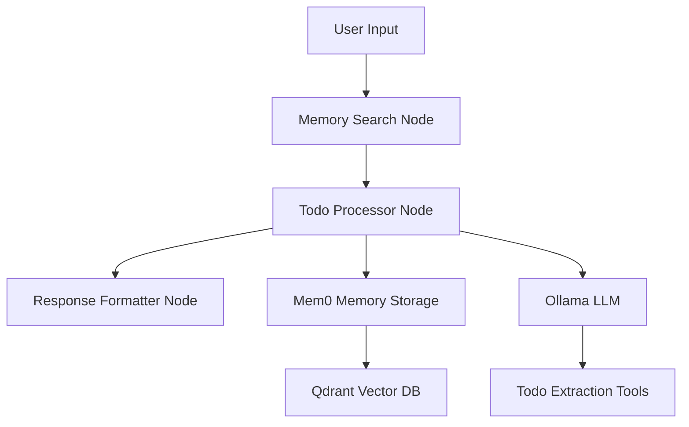

# LangGraph Todo Agent with Mem0, Qdrant & Ollama

A sophisticated todo management agent built with LangGraph that can create multiple todo items from natural language, remember past interactions using Mem0 memory, store embeddings in Qdrant, and run completely locally using Ollama.

## Features

🎯 **Multiple Todo Creation**: Extract multiple actionable items from a single natural language prompt
📝 **Smart Parsing**: Handles numbered lists, bullet points, and comma-separated tasks
🧠 **Persistent Memory**: Remembers past interactions and todo patterns using Mem0
🔍 **Semantic Search**: Find relevant past todos and interactions using vector search
🏠 **Fully Local**: Runs entirely on your machine with Ollama and local Qdrant
⚡ **Real-time Processing**: Fast response times with efficient memory management

## Architecture



## Prerequisites

### 1. Qdrant Vector Database
```bash
docker run -p 6333:6333 -p 6334:6334 \
    -v $(pwd)/qdrant_storage:/qdrant/storage:z \
    qdrant/qdrant
```

### 2. Ollama Local LLM
```bash
# Install Ollama
curl -fsSL https://ollama.ai/install.sh | sh

# Start Ollama
ollama serve

# Pull required models
ollama pull llama3.1:8b
ollama pull nomic-embed-text
```

### 3. Python Dependencies
```bash
pip install -e .
```

## Quick Start

### 1. Basic Usage
```python
import asyncio
from src.agent.graph import run_todo_agent

async def main():
    result = await run_todo_agent(
        user_input="I need to buy groceries, call mom, and finish the report by Friday",
        user_id="user123"
    )
    print(result["response"])

asyncio.run(main())
```

### 2. Run Demo
```bash
python demo.py
```

### 3. Interactive Mode
```bash
python demo.py
# Choose option 2 for interactive mode
```

## Example Interactions

### Creating Multiple Todos
**Input:** "Add buy groceries and call mom to my todo list"

**Output:** 
```
Created 2 todo items:

1. **buy groceries**
   Tags: buy
   ID: todo_0001

2. **call mom**
   Tags: call
   ID: todo_0002
```

### Structured Lists
**Input:** "Create todos for: 1. Review code 2. Send email to client 3. Update documentation"

**Output:**
```
Created 3 todo items:

1. **Review code**
   Tags: work
   ID: todo_0003

2. **Send email to client**
   Tags: work, email
   ID: todo_0004

3. **Update documentation**
   Tags: work
   ID: todo_0005
```

### Priority and Dates
**Input:** "Add urgent task: fix critical bug ASAP, and low priority: organize desk when possible"

**Output:**
```
Created 2 todo items:

1. **fix critical bug ASAP**
   Priority: high
   Tags: urgent
   ID: todo_0006

2. **organize desk when possible**
   Priority: low
   Tags: office, clean
   ID: todo_0007
```

## Configuration

### Environment Variables
```bash
# Qdrant Configuration
export QDRANT_HOST=localhost
export QDRANT_PORT=6333
export QDRANT_COLLECTION=todo_memories
# export QDRANT_API_KEY=your-api-key  # For Qdrant Cloud
# export QDRANT_URL=https://your-cluster.qdrant.tech  # For Qdrant Cloud

# Ollama Configuration
export OLLAMA_MODEL=llama3.1:8b
export OLLAMA_BASE_URL=http://localhost:11434
export OLLAMA_TEMPERATURE=0.1
export OLLAMA_MAX_TOKENS=2048

# Mem0 Configuration
export MEM0_HISTORY_PATH=./mem0_history.db
export MEM0_VERSION=v1.1
```

### Custom Configuration
```python
from src.agent.config import AgentConfig, QdrantConfig, OllamaConfig

config = AgentConfig(
    qdrant=QdrantConfig(
        host="localhost",
        port=6333,
        collection_name="my_todos"
    ),
    ollama=OllamaConfig(
        model="llama3.1:8b",
        temperature=0.1
    ),
    mem0=Mem0Config(
        history_db_path="./my_memory.db"
    )
)
```

## API Reference

### Core Functions

#### `run_todo_agent(user_input, user_id, agent_config=None)`
Main function to process todo requests.

**Parameters:**
- `user_input` (str): Natural language todo request
- `user_id` (str): Unique identifier for the user
- `agent_config` (AgentConfig, optional): Custom configuration

**Returns:**
- `Dict[str, Any]`: Response containing processed todos and memory updates

### Tools

#### `TodoManagerTool`
Extracts and creates multiple todo items from natural language.

#### `ListTodosTool`
Retrieves and displays todos from memory.

#### `CompleteTodoTool`
Marks todo items as completed.

## Memory System

The agent uses Mem0 for persistent memory with Qdrant as the vector backend:

- **Episodic Memory**: Stores specific interactions and todo creation events
- **Semantic Memory**: Enables search across past todos by meaning
- **User Context**: Maintains user-specific todo patterns and preferences
- **Tool Integration**: Automatically stores tool usage and results

## Supported Input Formats

### Natural Language
- "I need to buy groceries and call mom"
- "Add wash car to my todo list"
- "Create a task to finish the report by Friday"

### Structured Lists
- "1. Review code 2. Send email 3. Update docs"
- "- Buy milk - Walk dog - Pay bills"
- "• Task one • Task two • Task three"

### Priority Indicators
- "urgent: fix bug ASAP"
- "high priority: complete report"
- "low priority: organize desk when possible"

### Date/Time References
- "by Friday"
- "due tomorrow"
- "this weekend"
- "next week"

## Troubleshooting

### Qdrant Connection Issues
```bash
# Check if Qdrant is running
curl http://localhost:6333/collections

# Restart Qdrant
docker restart <qdrant-container-id>
```

### Ollama Issues
```bash
# Check Ollama status
ollama ps

# Restart Ollama
ollama serve

# Test model
ollama run llama3.1:8b "Hello world"
```

### Memory Issues
```bash
# Clear memory database
rm -f mem0_history.db

# Check Qdrant collections
curl http://localhost:6333/collections
```

## Development

### Project Structure
```
src/agent/
├── __init__.py
├── config.py          # Configuration management
├── state.py           # LangGraph state definitions
├── nodes.py           # LangGraph processing nodes
├── tools.py           # Todo management tools
└── graph.py           # Main LangGraph definition

demo.py                # Demo and interactive script
README.md              # This file
pyproject.toml         # Dependencies and project config
```

### Running Tests
```bash
# Run unit tests
pytest tests/unit_tests/

# Run integration tests (requires running services)
pytest tests/integration_tests/
```

### Adding New Features

1. **New Tools**: Add to `src/agent/tools.py`
2. **New Nodes**: Add to `src/agent/nodes.py`
3. **Graph Changes**: Update `src/agent/graph.py`
4. **Configuration**: Update `src/agent/config.py`

## Contributing

1. Fork the repository
2. Create a feature branch
3. Make your changes
4. Add tests
5. Submit a pull request

## License

MIT License - see LICENSE file for details.

## References

- [LangGraph Documentation](https://langchain-ai.github.io/langgraph/)
- [Mem0 Documentation](https://docs.mem0.ai/)
- [Qdrant Documentation](https://qdrant.tech/documentation/)
- [Ollama Documentation](https://ollama.ai/)
